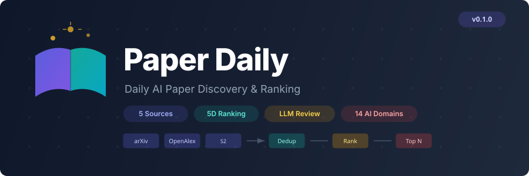

<p align="center">
  
</p>

<p align="center">
  <a href="https://github.com/deadpoppy/paper-daily/blob/main/LICENSE"></a>
  
  <a href="README.md"></a>
</p>

<p align="center">
  <a href="README.md">中文</a> | <b>English</b>
</p>

# 📚 Paper Daily

A daily AI paper recommendation tool. Automatically searches multiple academic sources in parallel, deduplicates, ranks with a 5-dimension scoring system, applies LLM-based academic quality review, and generates recommendation reasons — all persisted to a local SQLite database.

## ✨ Features

- 🔍 **Multi-source parallel search** — arXiv, OpenAlex, Semantic Scholar, CrossRef, Papers with Code (no authentication required)
- 🧹 **Smart deduplication** — DOI → arXiv ID → fuzzy title matching (rapidfuzz ≥ 0.88); fields merged by source priority
- 📊 **5-dimension uniform ranking** — relevance × recency × impact × novelty × **academic value**, each weighted 0.20
- 🎓 **LLM reviewer scoring** — Anthropic-compatible API (default: MiniMax-M2.7) evaluates academic quality, filters low-quality papers
- 📝 **Recommendation reasons** — reuses the same LLM API; falls back to keyword heuristics when no API key is configured
- 🗄️ **Local persistence** — SQLite (WAL mode) stores paper library, recommendation history, and academic evaluation cache
- 🔄 **Daily re-runnable** — automatically skips already-recommended papers; evaluation results are cached to avoid redundant API calls

## 🚀 Quick Start

### Installation

```bash
cd paper-daily
pip install -e .
```

Or with uv:

```bash
uv pip install -e .
```

### Configuration (optional but recommended)

Copy the example environment file and edit:

```bash
cp .env.example .env
```

```env
# ---------------------------------------------------------------------------
# Unified LLM API (Anthropic-compatible)
#   Used for BOTH academic-value assessment AND recommendation reasons.
# ---------------------------------------------------------------------------
ACADEMIC_VALUE_URL=https://api.minimaxi.com/anthropic
ACADEMIC_VALUE_API_KEY=sk-...
ACADEMIC_VALUE_MODEL=MiniMax-M2.7

# ---------------------------------------------------------------------------
# OpenAlex email (optional, increases rate limit)
# ---------------------------------------------------------------------------
OPENALEX_EMAIL=your@email.com

# ---------------------------------------------------------------------------
# Data directory
# ---------------------------------------------------------------------------
PAPER_DAILY_DATA_DIR=./data

# ---------------------------------------------------------------------------
# Search & output tuning
# ---------------------------------------------------------------------------
PAPER_DAILY_TOP_N=10
PAPER_DAILY_MAX_RESULTS=50
PAPER_DAILY_DAYS_BACK=180

# ---------------------------------------------------------------------------
# Ranking weights (5-dimension, uniform by default)
# ---------------------------------------------------------------------------
W_RELEVANCE=0.20
W_RECENCY=0.20
W_IMPACT=0.20
W_NOVELTY=0.20
W_ACADEMIC_VALUE=0.20
```

**Works without an API key**: when `ACADEMIC_VALUE_*` is not set, academic value defaults to a neutral 0.5; recommendation reasons fall back to keyword heuristics.

### Usage

```bash
# Full pipeline: search last 180 days → dedup → rank → generate reasons → output Top 10
paper-daily run

# Custom output count and lookback window
paper-daily run -n 10 -d 180

# Use a custom .env file
paper-daily run --env /path/to/.env

# Verbose logging
paper-daily run -v

# View recommendation history
paper-daily history
paper-daily history --days 7 -f markdown
paper-daily history --limit 100
```

## 📁 Output

After running, the `data/` directory contains:

| File | Description |
|------|-------------|
| `paper_daily.db` | SQLite database (papers + recommendations + academic cache) |
| `recommendations_YYYY-MM-DD.md` | Markdown recommendation list |
| `recommendations_YYYY-MM-DD.json` | JSON raw data (with full `_scores` breakdown) |
| `recommendations_latest.md/json` | Symlinks to the latest recommendation |

### Console Output Example

```
📚 Paper Daily Top 3 | 2026-04-30

1. 【One-for-All: A Universal Model Unifying Visual ...】(2026) arXiv
   🎓 Academic Value: 8.5/10 | Proposes a unified visual task paradigm with theoretical grounding and thorough experiments
   💡 This paper proposes a unified visual model framework that simultaneously handles classification, detection, segmentation...
   🔗 https://arxiv.org/abs/2501.xxxxx

2. 【Efficient Reward Modeling for RLHF】...
   ...
```

## 🏗️ Architecture & Data Flow

```
paper-daily run
    │
    ├── search.py          Parallel search across 5 academic sources (time-sorted, recent first)
    ├── dedup.py           DOI + arXiv ID + fuzzy title dedup; fields merged by source priority
    ├── pipeline.py        Orchestration: pre-rank → prune → academic eval → final rank
    ├── ranker.py          5-dimension scoring engine (all dimensions normalized to [0,1])
    ├── academic_value.py  LLM reviewer 0–10 academic quality scoring + SQLite cache + infinite retry
    ├── reviewer.py        Reuses Anthropic-compatible API / fallback for recommendation reasons
    ├── output.py          Writes to SQLite + Markdown + JSON
    └── database.py        papers / recommendations / academic_cache management
```

### Ranking Logic

Five dimensions, **uniformly weighted** at **0.20** each:

1. **Relevance** — Jaccard-like maximum overlap between paper text and topic keyword set.
2. **Recency** — ≤30 days=1.0, ≤90 days=0.9, ≤180 days=0.8, then exponential decay.
3. **Impact** — relative citation count within the batch with square decay `(relative)^2`, ensuring only the most cited papers get a significant boost while new papers aren't overly penalized.
4. **Novelty** — never recommended=1.0, previously recommended=0.0.
5. **Academic Value** — LLM reviewer 0–10 score normalized to [0,1].

### Academic Evaluation Pipeline

1. Pre-rank all new papers using 4 dimensions (excluding academic value)
2. **Prune the bottom 20%** (eliminate clearly irrelevant papers)
3. Call LLM reviewer on **all remaining candidates**
4. Combine academic value for final 5D ranking, take Top N

First run may evaluate dozens of papers; subsequent runs mostly hit `academic_cache`, only calling the API for uncached new papers.

### Academic Evaluation Cache

The `academic_cache` table permanently caches evaluations keyed by `SHA256(title + abstract)`. To re-evaluate a paper, delete the corresponding cache row:

```sql
DELETE FROM academic_cache WHERE content_hash = '...';
```

### Infinite Retry Mechanism

Academic evaluation API calls are retried automatically with **no maximum attempt limit**:

- Backoff interval: `1s, 2s, 4s, 8s, 16s, 30s, 30s, ...` (capped at 30s)
- Exits the loop only when a `<score>` tag is successfully parsed
- Concurrency limited to 3 to avoid overwhelming the API endpoint

## 🔎 Search Topics

Covers **14 AI sub-domains** by default, each using the top 3 keywords across 5 sources (up to 50 results per source, descending by date):

| Key | Domain | Example Keywords |
|-----|--------|-----------------|
| `llm` | Large Language Models | large language model, LLM, transformer, reasoning |
| `vision` | Computer Vision | computer vision, diffusion model, image generation, segmentation |
| `rl` | Reinforcement Learning | reinforcement learning, RLHF, PPO, Q-learning |
| `multimodal` | Multimodal Learning | multimodal, vision-language model, cross-modal |
| `agent` | AI Agents | AI agent, autonomous agent, tool use, planning |
| `efficiency` | Efficiency & Systems | model efficiency, quantization, pruning, distillation |
| `genai` | Generative AI | generative AI, text-to-image, text-to-video, flow model |
| `embodied` | Embodied AI | embodied AI, robot learning, manipulation, humanoid robot |
| `autonomous_driving` | Autonomous Driving | autonomous driving, self-driving, end-to-end driving |
| `foundation_model` | Foundation Models | foundation model, pre-training, scaling law, emergent ability |
| `world_model` | World Models | world model, environment model, predictive model |
| `slam` | SLAM | SLAM, simultaneous localization and mapping, visual odometry |
| `end_to_end` | End-to-End Learning | end-to-end learning, end-to-end system, end-to-end training |
| `dl_theory` | Deep Learning Theory | neural network theory, optimization landscape, representation learning |

Customize by editing `_default_topics()` in `src/paper_daily/config.py`.

## 🗄️ Database Schema

Running automatically creates `data/paper_daily.db` (WAL mode) with three tables:

### `papers` — Paper Library (deduplicated)

| Field | Type | Description |
|-------|------|-------------|
| `id` | INTEGER PK | Auto-increment primary key |
| `doi` | TEXT UNIQUE | DOI |
| `arxiv_id` | TEXT UNIQUE | arXiv ID |
| `title` | TEXT NOT NULL | Title |
| `authors` | TEXT | Author list (JSON string) |
| `abstract` | TEXT | Abstract |
| `year` | INTEGER | Publication year |
| `published_date` | TEXT | Publication date (YYYY-MM-DD) |
| `venue` | TEXT | Journal / Conference |
| `citation_count` | INTEGER | Citation count |
| `url` | TEXT | Paper URL |
| `sources` | TEXT | Search sources (comma-separated) |
| `created_at` | TEXT | Ingestion timestamp |

### `recommendations` — Recommendation History

| Field | Type | Description |
|-------|------|-------------|
| `id` | INTEGER PK | Auto-increment primary key |
| `paper_id` | INTEGER FK | References `papers.id` |
| `recommend_date` | TEXT | Recommendation date (YYYY-MM-DD) |
| `rank` | INTEGER | Rank for that day |
| `score` | REAL | 5-dimension composite score |
| `reason_zh` | TEXT | Recommendation reason |
| `academic_score` | REAL | Academic value score (0–1) |
| `created_at` | TEXT | Record timestamp |

### `academic_cache` — Academic Evaluation Cache

| Field | Type | Description |
|-------|------|-------------|
| `id` | INTEGER PK | Auto-increment primary key |
| `content_hash` | TEXT UNIQUE | SHA256(title + abstract) |
| `title` | TEXT | Paper title (for human readability) |
| `academic_score` | REAL NOT NULL | Academic score (0–1) |
| `academic_reason` | TEXT | Evaluation reason |
| `created_at` | TEXT | Cache timestamp |

### Example Queries

```bash
sqlite3 data/paper_daily.db
```

```sql
-- Today's Top 10 recommendations
SELECT r.rank, p.title, p.venue, r.score, r.academic_score, r.reason_zh
FROM recommendations r
JOIN papers p ON p.id = r.paper_id
WHERE r.recommend_date = date('now')
ORDER BY r.rank;

-- Recommendation history for a specific paper
SELECT r.recommend_date, r.rank, r.score, r.academic_score
FROM recommendations r
JOIN papers p ON p.id = r.paper_id
WHERE p.doi = '10.xxxx/xxxxx'
ORDER BY r.recommend_date DESC;

-- Top papers by academic value in the last 7 days
SELECT r.recommend_date, r.rank, p.title, r.academic_score, r.reason_zh
FROM recommendations r
JOIN papers p ON p.id = r.paper_id
WHERE r.recommend_date >= date('now', '-7 days')
ORDER BY r.academic_score DESC, r.recommend_date DESC
LIMIT 20;

-- Check cache hit rate (helps gauge API overhead)
SELECT COUNT(*) as total_cache_entries FROM academic_cache;

-- Search cache by title
SELECT * FROM academic_cache WHERE title LIKE '%transformer%';

-- Papers contributed by each source combination
SELECT p.sources, COUNT(*) as cnt
FROM papers p
GROUP BY p.sources;
```

## ⚙️ Advanced Configuration

### Environment Variable Reference

| Variable | Default | Description |
|----------|---------|-------------|
| `PAPER_DAILY_DATA_DIR` | `./data` | Data directory |
| `PAPER_DAILY_TOP_N` | `10` | Number of daily recommendations |
| `PAPER_DAILY_MAX_RESULTS` | `50` | Max results per source per topic |
| `PAPER_DAILY_DAYS_BACK` | `180` | Lookback window in days |
| `ACADEMIC_VALUE_URL` | — | Unified LLM API base URL (Anthropic-compatible) |
| `ACADEMIC_VALUE_API_KEY` | — | Unified LLM API key |
| `ACADEMIC_VALUE_MODEL` | `MiniMax-M2.7` | Unified LLM model name |
| `OPENALEX_EMAIL` | — | OpenAlex email (increases rate limit) |
| `W_RELEVANCE` | `0.20` | Relevance weight |
| `W_RECENCY` | `0.20` | Recency weight |
| `W_IMPACT` | `0.20` | Impact weight |
| `W_NOVELTY` | `0.20` | Novelty weight |
| `W_ACADEMIC_VALUE` | `0.20` | Academic value weight |

## ⚠️ Notes

1. **First run** takes a while (parallel search across 14 topics × 5 sources + academic evaluation for many new papers).
2. **API cost**: academic evaluation and recommendation reasons share the same API. Evaluation is only called for uncached new papers; reasons are only generated for the final Top N. First run may evaluate dozens of papers (~200–400 tokens each); subsequent runs mostly hit cache.
3. **Infinite retry**: academic evaluation uses exponential backoff (capped at 30s, no max attempts). If the API stalls, it recovers automatically. Press `Ctrl+C` to interrupt.
4. **Rate limiting**: individual sources (e.g., Semantic Scholar) may return 429 on short bursts. The system skips that source and continues — no impact on the overall pipeline.
5. **Recommendation reasons** default to **fallback heuristics**; configure `ACADEMIC_VALUE_*` to enable higher-quality LLM-generated reasons.

## 📄 License

[MIT](LICENSE)
